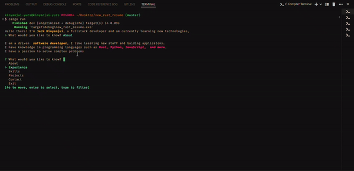

# Rust Resume

# Rust Resume TUI Project

🚀 This is a Rust project that displays projects, skills,contacts,Experiences on the terminal

## Demo Gif




## Installation

1. Clone the repository:

    ```bash
    git clone https://github.com/jck-bit/rust-resume-cli
    ```

2. Navigate to the project directory:

    ```bash
    cd rust-resume-cli
    ```

3. Build the project:

    ```bash
    cargo build
    ```

4. Run the project:

    ```bash
    cargo run
    ```

## Usage

- Use  'up' and 'down' arrow keys to navigate through Experience, Projects, About, Skills


## Dependencies

- Rust programming language

## Contributing

Contributions are welcome! If you encounter any issues or have suggestions for improvements, please open an issue or submit a pull request.

## License

This project is licensed under the MIT License - see the [LICENSE](LICENSE) file for details.
